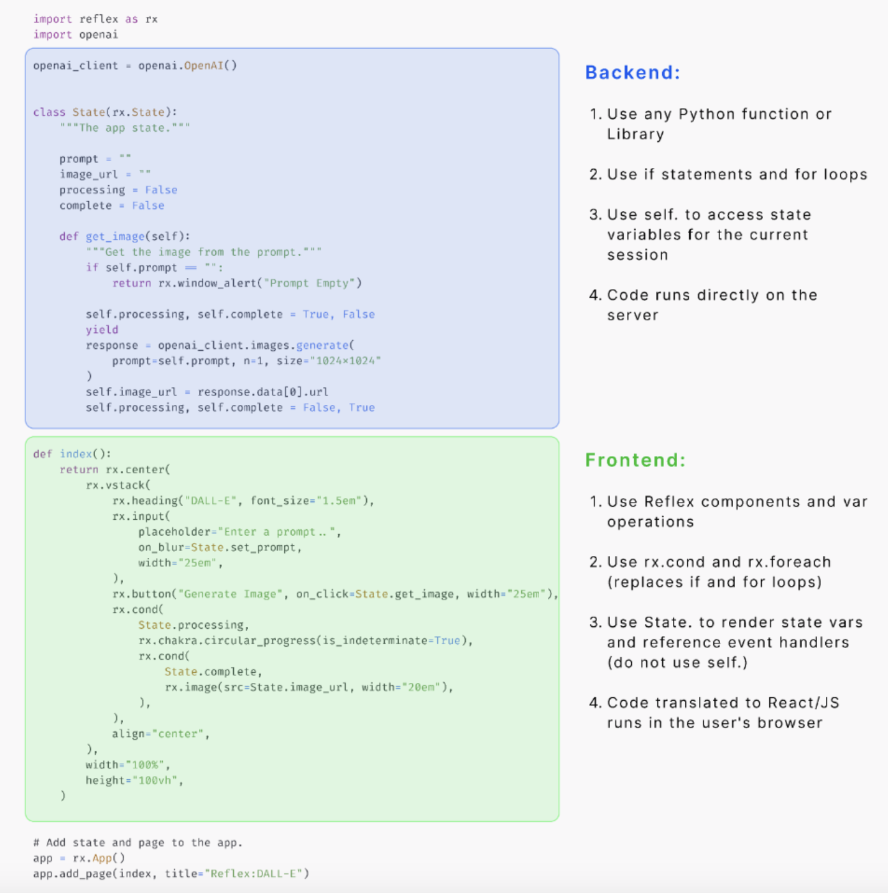

```diff
+ Searching for Pynecone? You are in the right repo. Pynecone has been renamed to Reflex. +
```

<div align="center">


<hr>

### **✨ Performant, customizable web apps in pure Python. Deploy in seconds. ✨**
[](https://badge.fury.io/py/reflex)


[](https://reflex.dev/docs/getting-started/introduction)
[](https://discord.gg/T5WSbC2YtQ)
</div>

---

[English](https://github.com/reflex-dev/reflex/blob/main/README.md) | [简体中文](https://github.com/reflex-dev/reflex/blob/main/docs/zh/zh_cn/README.md) | [繁體中文](https://github.com/reflex-dev/reflex/blob/main/docs/zh/zh_tw/README.md) | [Türkçe](https://github.com/reflex-dev/reflex/blob/main/docs/tr/README.md) | [हिंदी](https://github.com/reflex-dev/reflex/blob/main/docs/in/README.md) | [Português (Brasil)](https://github.com/reflex-dev/reflex/blob/main/docs/pt/pt_br/README.md) | [Italiano](https://github.com/reflex-dev/reflex/blob/main/docs/it/README.md) | [Español](https://github.com/reflex-dev/reflex/blob/main/docs/es/README.md) | [한국어](https://github.com/reflex-dev/reflex/blob/main/docs/kr/README.md) | [日本語](https://github.com/reflex-dev/reflex/blob/main/docs/ja/README.md) | [Deutsch](https://github.com/reflex-dev/reflex/blob/main/docs/de/README.md) | [Persian (پارسی)](https://github.com/reflex-dev/reflex/blob/main/docs/pe/README.md)

---

# Reflex

Reflex is a library to build full-stack web apps in pure Python.

Key features:
* **Pure Python** - Write your app's frontend and backend all in Python, no need to learn Javascript.
* **Full Flexibility** - Reflex is easy to get started with, but can also scale to complex apps.
* **Deploy Instantly** - After building, deploy your app with a [single command](https://reflex.dev/docs/hosting/deploy-quick-start/) or host it on your own server.

See our [architecture page](https://reflex.dev/blog/2024-03-21-reflex-architecture/#the-reflex-architecture) to learn how Reflex works under the hood.

## ⚙️ Installation

Open a terminal and run (Requires Python 3.8+):

```bash
pip install reflex
```

## 🥳 Create your first app

Installing `reflex` also installs the `reflex` command line tool.

Test that the install was successful by creating a new project. (Replace `my_app_name` with your project name):

```bash
mkdir my_app_name
cd my_app_name
reflex init
```

This command initializes a template app in your new directory. 

You can run this app in development mode:

```bash
reflex run
```

You should see your app running at http://localhost:3000.

Now you can modify the source code in `my_app_name/my_app_name.py`. Reflex has fast refreshes so you can see your changes instantly when you save your code.


## 🫧 Example App

Let's go over an example: creating an image generation UI around [DALL·E](https://platform.openai.com/docs/guides/images/image-generation?context=node). For simplicity, we just call the [OpenAI API](https://platform.openai.com/docs/api-reference/authentication), but you could replace this with an ML model run locally.

&nbsp;

<div align="center">

</div>

&nbsp;

Here is the complete code to create this. This is all done in one Python file!


  
```python
import reflex as rx
import openai

openai_client = openai.OpenAI()


class State(rx.State):
    """The app state."""

    prompt = ""
    image_url = ""
    processing = False
    complete = False

    def get_image(self):
        """Get the image from the prompt."""
        if self.prompt == "":
            return rx.window_alert("Prompt Empty")

        self.processing, self.complete = True, False
        yield
        response = openai_client.images.generate(
            prompt=self.prompt, n=1, size="1024x1024"
        )
        self.image_url = response.data[0].url
        self.processing, self.complete = False, True


def index():
    return rx.center(
        rx.vstack(
            rx.heading("DALL-E", font_size="1.5em"),
            rx.input(
                placeholder="Enter a prompt..",
                on_blur=State.set_prompt,
                width="25em",
            ),
            rx.button(
                "Generate Image", 
                on_click=State.get_image,
                width="25em",
                loading=State.processing
            ),
            rx.cond(
                State.complete,
                rx.image(src=State.image_url, width="20em"),
            ),
            align="center",
        ),
        width="100%",
        height="100vh",
    )

# Add state and page to the app.
app = rx.App()
app.add_page(index, title="Reflex:DALL-E")
```


## Let's break this down.

<div align="center">

</div>


### **Reflex UI**

Let's start with the UI.

```python
def index():
    return rx.center(
        ...
    )
```

This `index` function defines the frontend of the app.

We use different components such as `center`, `vstack`, `input`, and `button` to build the frontend. Components can be nested within each other
to create complex layouts. And you can use keyword args to style them with the full power of CSS.

Reflex comes with [60+ built-in components](https://reflex.dev/docs/library) to help you get started. We are actively adding more components, and it's easy to [create your own components](https://reflex.dev/docs/wrapping-react/overview/).

### **State**

Reflex represents your UI as a function of your state.

```python
class State(rx.State):
    """The app state."""
    prompt = ""
    image_url = ""
    processing = False
    complete = False

```

The state defines all the variables (called vars) in an app that can change and the functions that change them.

Here the state is comprised of a `prompt` and `image_url`. There are also the booleans `processing` and `complete` to indicate when to disable the button (during image generation) and when to show the resulting image.

### **Event Handlers**

```python
def get_image(self):
    """Get the image from the prompt."""
    if self.prompt == "":
        return rx.window_alert("Prompt Empty")

    self.processing, self.complete = True, False
    yield
    response = openai_client.images.generate(
        prompt=self.prompt, n=1, size="1024x1024"
    )
    self.image_url = response.data[0].url
    self.processing, self.complete = False, True
```

Within the state, we define functions called event handlers that change the state vars. Event handlers are the way that we can modify the state in Reflex. They can be called in response to user actions, such as clicking a button or typing in a text box. These actions are called events.

Our DALL·E. app has an event handler, `get_image` to which get this image from the OpenAI API. Using `yield` in the middle of an event handler will cause the UI to update. Otherwise the UI will update at the end of the event handler.

### **Routing**

Finally, we define our app.

```python
app = rx.App()
```

We add a page from the root of the app to the index component. We also add a title that will show up in the page preview/browser tab.

```python
app.add_page(index, title="DALL-E")
```

You can create a multi-page app by adding more pages.

## 📑 Resources

<div align="center">

📑 [Docs](https://reflex.dev/docs/getting-started/introduction) &nbsp; |  &nbsp; 🗞️ [Blog](https://reflex.dev/blog) &nbsp; |  &nbsp; 📱 [Component Library](https://reflex.dev/docs/library) &nbsp; |  &nbsp; 🖼️ [Gallery](https://reflex.dev/docs/gallery) &nbsp; |  &nbsp; 🛸 [Deployment](https://reflex.dev/docs/hosting/deploy-quick-start)  &nbsp;   

</div>


## ✅ Status

Reflex launched in December 2022 with the name Pynecone.

As of February 2024, our hosting service is in alpha! During this time anyone can deploy their apps for free. See our [roadmap](https://github.com/reflex-dev/reflex/issues/2727) to see what's planned.

Reflex has new releases and features coming every week! Make sure to :star: star and :eyes: watch this repository to stay up to date.

## Contributing

We welcome contributions of any size! Below are some good ways to get started in the Reflex community.

-   **Join Our Discord**: Our [Discord](https://discord.gg/T5WSbC2YtQ) is the best place to get help on your Reflex project and to discuss how you can contribute.
-   **GitHub Discussions**: A great way to talk about features you want added or things that are confusing/need clarification.
-   **GitHub Issues**: [Issues](https://github.com/reflex-dev/reflex/issues) are an excellent way to report bugs. Additionally, you can try and solve an existing issue and submit a PR.

We are actively looking for contributors, no matter your skill level or experience. To contribute check out [CONTIBUTING.md](https://github.com/reflex-dev/reflex/blob/main/CONTRIBUTING.md)


## All Thanks To Our Contributors:
<a href="https://github.com/reflex-dev/reflex/graphs/contributors">
  
</a>

## License

Reflex is open-source and licensed under the [Apache License 2.0](LICENSE).
