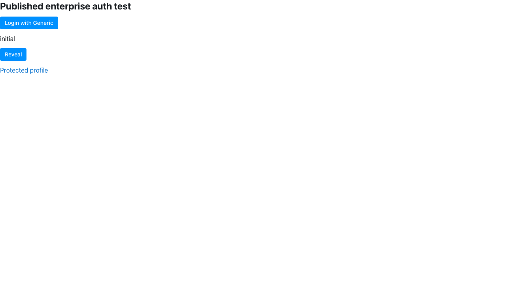

# Published enterprise a3 with the alpha graph

Published `reflex-enterprise==0.9.7a3` resolves the previously demonstrated a2
field-render, extra-scope startup, and logout failures on Reflex 0.10.0a1.
The full retained auth app now compiles and passes **21/22** browser cases.
Two additional residual behaviors remain in this alpha run: an async protected
computed value is not redelivered after public-page reload, and default-scope
iframe popup login does not automatically return to/replay the originating
page. These are observed behaviors, not claims that a3 introduced regressions.

## Package and directory isolation

The fresh environment is
`/private/tmp/reflex-enterprise-a3-20261005-alpha`, using CPython 3.12.1 on
macOS arm64. Installation used the official PyPI index and the retained exact
freeze with only enterprise changed from a2 to a3. Resolver installation
succeeded without any other dependency change:
[requested graph](requirements-requested.txt), [actual freeze](requirements-lock.txt),
[graph difference](graph-diff.json), and [install log](logs/install.log).

All app and driver execution occurred in the copied neutral tree
`/private/tmp/reflex-enterprise-a3-20261005-auth-alpha`, using
`uv --no-config run --no-project --python ...` with `PYTHONPATH` unset.
Imports resolve to the fresh environment's site-packages; see
[provenance](logs/provenance.json). No checkout/editable/source distribution
installation or tested-library patch was used.

The retained Python app/reference sources were copied without generated `.web`,
state, cache or lock files. App bodies are unchanged; configurations set the
reserved ports and the verified official Bun 1.4.2 path
`/private/tmp/reflex-pre-js-runtime-20261005/bun/bin/bun`. The anonymous MCP
backend-only configuration omits the frontend port, which the CLI otherwise
rejects in that mode. Driver adaptations rename evidence outputs, add the
requested logout/relogin and combined iframe assertions, add inert diagnostics,
and format/sort imports. [Source hashes](sources.json) distinguish unchanged
retained files from these adaptations. A2 evidence was preserved.

The development auth commands use `CI=true`, as in the original auth campaign,
to bypass cloud-account login; this report tests local OIDC/MCP compatibility,
not live entitlement. The provider is the published `oidc-provider-mock==0.4.2`
on port 9131 with fictional Alice/Bob accounts. Browser execution uses published
Playwright 1.55.0 and its private Chromium 140 runtime. Root handles the separate
Free-tier/public guard campaign.

## Results

| Check | Result | Evidence |
| --- | --- | --- |
| Four field-render variants: enterprise auth False/True, plain annotation, core control | 4/4 pass; all become `NumberCastedVar` | `logs/repro-auth-field.log`, final formatted-copy rerun `logs/repro-auth-field-final.log` |
| OIDC extra-scope metadata setup | Pass despite removed `backend_vars` remaining absent | `logs/repro-oidc-scopes.log` |
| Formerly failing full upstream auth app compile/start | Pass through public CLI | `logs/auth-full-server.log` |
| Retained non-custom upstream browser cases | 21/22 pass | `logs/auth-full-browser.json`, `logs/auth-full-driver.log` |
| Independent default-scope app | 3/4 pass; combined iframe replay fails | `logs/auth-min-default-browser.json` |
| Independent extra-scope app (`offline_access`) compile/start/browser | 4/4 pass | `logs/auth-min-extra-server.log`, `logs/auth-min-extra-browser.json` |
| Former minimal logout reproducer | Pass; provider end-session reached, no Logout error or old name visible | `logs/repro-logout-a3.json` |
| MCP OAuth discovery/registration/consent/S256 PKCE exchange/protected event/read/redaction | Pass | `logs/mcp-oauth.json` |
| OAuth code reuse and rotated refresh-token reuse | Both rejected with HTTP 400 | Same |
| Anonymous MCP missing/fabricated bearer | Both HTTP 401 | `logs/mcp-anonymous.json` |
| Anonymous MCP mutation, computed reads, independent sessions, custom resource and redaction | Pass: A count/doubled 4/8, B 0/0 | Same |

The full app's passing cases cover anonymous withholding, login return target,
public/protected fields and computed vars, sync/async authorization checks,
event replay, refresh, client navigation, logout event/provider flow,
reprotection, and Alice-to-Bob protected-state reset. The independent app also
checks normalized name/email, clean logged-out UI, refresh, Bob relogin and
protected event execution in both default and extra-scope modes.




## Residual observations

1. **Async protected computed value stays at its placeholder after reload.**
   `test_protected_vars_survive_reload_on_public_page` logs Alice in, visits the
   public index, confirms `async-admin-data`, then reloads. Synchronous protected
   secret/admin values return correctly, but `#async-admin-view` remains
   `async-admin-placeholder`. The full run fails this one case. A diagnostic
   driver reproduced it in 3/3 additional fresh contexts, and another 15 seconds
   did not deliver the value. No JavaScript page error or backend traceback was
   observed. [Filtered WebSocket/HTTP evidence](logs/reload-repeat.json),
   [repeat driver](recheck_reload.py), and [screenshot](screenshots/reload-repeat-3.png).
   The filtered frames retain harmless fixture values and delta-state names,
   without capturing provider token values. This report establishes a residual
   alpha behavior; a same-a3 stable comparison belongs to the parallel campaign.

2. **Default-scope iframe pending replay stalls at the embedded login page.**
   The new combined case starts anonymous in an iframe, clicks protected Reveal,
   then signs Alice in through the login popup. The popup succeeds/closes, but
   the child stays at `/login?redirect_to=%2F` and the pending event remains in
   SessionStorage. It failed in the initial authoring run and corrected default
   matrix, then in 3/3 fresh focused repeats even after 10 additional seconds.
   An inert message observer confirms the child receives `post_auth_generic`
   from the app origin. Explicitly navigating that existing child back to `/`
   successfully replays the protected event and consumes storage in 3/3 repeats.
   This demonstrates that authentication and the saved event can work, while
   automatic return/replay stalls. [Repeat evidence](logs/iframe-repeat.json),
   [driver](recheck_iframe.py), [screenshot](screenshots/iframe-repeat-3.png).

   The distinction matters: direct iframe popup login followed by Reveal passes,
   normal top-level pending replay passes, and the combined iframe case passes
   in the extra-scope configuration. This newly exercised combination had no
   retained a2 baseline. Root's parallel stable control will classify its scope;
   this report does not label it an a3 regression or authorization bypass.

## Diagnostics and reusable-driver review

The full/default/extra browser matrices have no page or console errors and no
recorded HTTP error responses in the independent app. They do record respectively
24, 9 and 11 `requestfailed` events, all `net::ERR_ABORTED`. The full suite has
21 cookie-sync aborts and three development index-route-module aborts; the two
independent matrices' aborts all concern `/_reflex/cookies/sync` during
navigation. Those raw counts are preserved in
[browser-summary.json](logs/browser-summary.json); this is not a claim that
every network request completed cleanly. Auth/MCP server logs have no matched
traceback, AttributeError or Logout-error output. Expected notices include
console deprecations, the default Sitemap-plugin warning, and the in-memory
token-store limitation. Redis/multiple workers were not tested.

One initial logout assertion compared the home URL literally and rejected the
mock provider's valid `/?state=...` return. The matcher was corrected to permit
that query; the attempt remains under `logs/attempts/default-strict-home-url`.
The embedded replay failure was present in both attempts. The first anonymous
backend command was rejected because its config specified a frontend port;
that diagnostic is retained separately, and omitting the unused frontend port
allowed the public backend-only command to run.

Adversarial review concerns for future reuse:

1. Diagnostic repeat drivers deliberately record failing observations without
   exiting nonzero. Inspect their JSON/pass fields; their process exit status
   alone is not acceptance. The main full/min matrices do exit nonzero on a
   failed case.
2. MCP OAuth records browser errors but does not assert the list is empty in the
   retained driver. This run was manually inspected and contains no page/console
   errors; future runs should not infer that solely from exit status.
3. These checks use fictional local claims, development servers, disk state and
   an in-memory OAuth store. They do not establish live IdP/cloud entitlement,
   Redis/multi-worker behavior, custom login/callback wrappers, every denial
   path, or all browser engines. No framework fix or issue filing is included.

Focused Ruff E4/E7/E9/F/I/B and formatting checks pass for all 13 selected
drivers/configs. All 44 saved Python source files parse. Inherited reference
samples were retained rather than subjected to broad style/type rewrites.

## Reproduction and cleanup

Create the fresh environment and install the exact graph from the workspace:

```sh
UV_CACHE_DIR=/private/tmp/reflex-enterprise-uv-cache /Users/masenf/.local/bin/uv --no-config venv --python /private/tmp/reflex-enterprise-test-20261005/bin/python /private/tmp/reflex-enterprise-a3-20261005-alpha
UV_CACHE_DIR=/private/tmp/reflex-enterprise-uv-cache /Users/masenf/.local/bin/uv --no-config pip install --python /private/tmp/reflex-enterprise-a3-20261005-alpha/bin/python --index-url https://pypi.org/simple -r prerelease_testing/2026-10-05/enterprise/a3/auth-alpha/requirements-requested.txt
```

Copy this report's `apps`, `reference`, and Python drivers to the neutral tree,
excluding generated files, and create `logs` and `screenshots` there. From
`/private/tmp/reflex-enterprise-a3-20261005-auth-alpha/apps/auth_min`, start the
provider in one terminal:

```sh
env -u PYTHONPATH UV_CACHE_DIR=/private/tmp/reflex-enterprise-uv-cache /Users/masenf/.local/bin/uv --no-config run --no-project --python /private/tmp/reflex-enterprise-a3-20261005-alpha/bin/python python ../../mock_oidc.py
```

Start an auth app from its corresponding neutral `apps/auth` or `apps/auth_min`
directory through the exact public CLI prefix:

```sh
env -u PYTHONPATH CI=true REFLEX_DIR=/private/tmp/reflex-enterprise-a3-20261005-runtime REFLEX_CHECK_LATEST_VERSION=false NPM_CONFIG_REGISTRY=https://registry.npmjs.org OIDC_ISSUER_URI=http://localhost:9131 OIDC_CLIENT_ID=reflex-integration-test OIDC_CLIENT_SECRET=reflex-integration-test-secret AUTHLIB_INSECURE_TRANSPORT=1 UV_CACHE_DIR=/private/tmp/reflex-enterprise-uv-cache /Users/masenf/.local/bin/uv --no-config run --no-project --python /private/tmp/reflex-enterprise-a3-20261005-alpha/bin/python reflex run --frontend-port 3132 --backend-port 8132 --loglevel debug
```

For extra scopes, add `AUTH_TEST_EXTRA_SCOPES=1` to both app and min-driver
environment. From the same app directory, use this driver prefix:

```sh
env -u PYTHONPATH PLAYWRIGHT_BROWSERS_PATH=/private/tmp/reflex-enterprise-browsers UV_CACHE_DIR=/private/tmp/reflex-enterprise-uv-cache /Users/masenf/.local/bin/uv --no-config run --no-project --python /private/tmp/reflex-enterprise-a3-20261005-alpha/bin/python python ../../drive_auth.py
```

Replace the final filename with `drive_auth_min.py`, `recheck_reload.py`,
`recheck_iframe.py`, `repro_logout.py`, or `check_mcp_oauth.py` for the relevant
running app. The metadata/field scripts require no server. Stop the auth app
before starting the anonymous sample from neutral `apps/components`:

```sh
env -u PYTHONPATH CI=true REFLEX_DIR=/private/tmp/reflex-enterprise-a3-20261005-runtime REFLEX_CHECK_LATEST_VERSION=false NPM_CONFIG_REGISTRY=https://registry.npmjs.org UV_CACHE_DIR=/private/tmp/reflex-enterprise-uv-cache /Users/masenf/.local/bin/uv --no-config run --no-project --python /private/tmp/reflex-enterprise-a3-20261005-alpha/bin/python reflex run --backend-only --backend-port 8132 --backend-host 127.0.0.1 --loglevel debug
```

Run `../../check_mcp.py` with the same isolated Python prefix. All owned CLI,
browser and provider processes were stopped after evidence collection; no
listeners remain on 3132/8132/9131. No installer or shell-profile mutation was
needed. [Final audit](logs/final-audit.json) records cleanup and graph parity.
Temporary environments remain available for independent reproduction.
