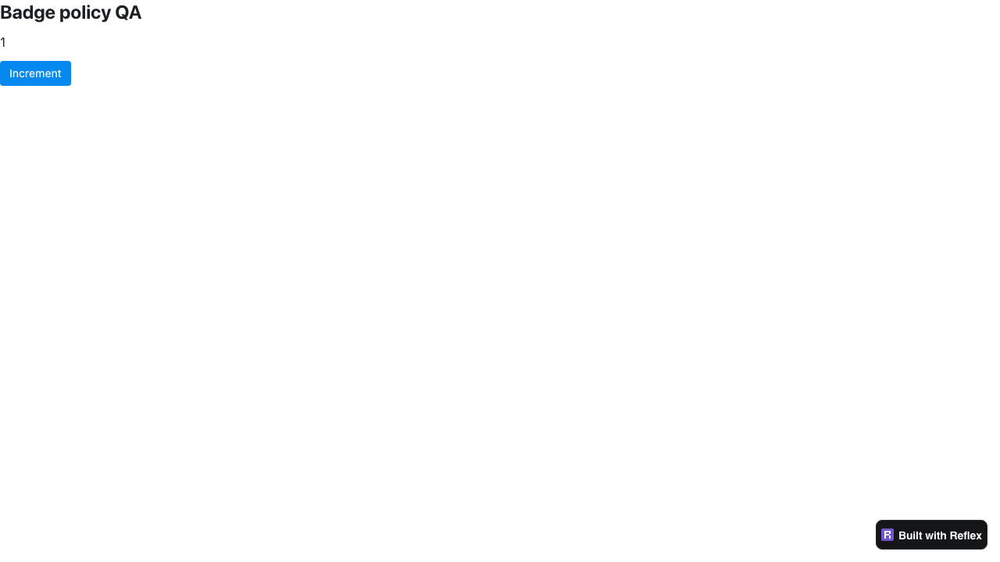

# Free-tier production and export verification

All eight scenarios passed through the published Reflex CLI with enterprise
0.9.7a2 and Reflex 0.10.0a1. This closes the local guard/badge coverage gap for
enterprise PR #241. Actual cloud account entitlement remains unverified: the
official hosting SDK authenticated fictional credentials against a disposable
HTTP API on loopback.

Free-tier `show_built_with_reflex=False` warns, changes the setting to `True`,
and continues production/export with a visible badge. That is the behavior
described by [PR #241](../reference/pr-241.json), because badge enforcement
precedes the command guard. Expecting the entire command to fail would test
the wrong public behavior.

## Results

| Scenario | Actual CLI/browser/export result |
| --- | --- |
| Free production, badge `True` | Page and badge visible; Increment changes backend state from 0 to 1; no page or console errors |
| Free production, badge `False` | Restriction warning; page and forced badge visible; Increment changes backend state from 0 to 1; no page or console errors |
| Free production export, badge `True` | Exit 0; valid frontend ZIP; badge in server-rendered HTML |
| Free production export, badge `False` | Restriction warning; exit 0; valid frontend ZIP with forced badge |
| Free development export, badge `True` | Exit 0; valid frontend ZIP with badge; static HTTP/browser rendering confirms it remains visible |
| Enterprise production export, badge `False` | Exit 0; valid frontend ZIP without badge or restriction warning |
| Rejected credential, production | SDK receives HTTP 401; clear login error; no app server remains; CLI exits 0 |
| Rejected credential, export | SDK receives HTTP 401; clear login error; no ZIP produced; CLI exits 0 |

The development export was served as frontend-only static files. Its browser
reported expected WebSocket connection failures to the absent loopback backend
and showed the connection-error toast, while rendering the page and badge.
It had no JavaScript page errors. This case proves exported badge inclusion,
not backend event handling for a standalone frontend export.

Primary evidence: [results and exact child commands](results.json),
[driver log](driver.log), per-case CLI/context/network logs under `logs/`, and
the saved exported `index.html` files. ZIP byte counts, SHA256 hashes and member
counts are recorded; the temporary ZIP/credential directories were removed.



## Guard and account fixture integrity

The tested graph and import origins are recorded in `results.json` and the
parent [frozen requirements](../requirements-lock.txt). App/runtime imports
resolve inside `/private/tmp/reflex-enterprise-test-20261005`, with no checkout,
editable install or library patch. The app uses `rxe.Config` and `rxe.App`,
plus a core `rx.State` counter. It runs on the previously verified official
Bun 1.4.2 from `/private/tmp/reflex-pre-js-runtime-20261005/bun/bin/bun`.
Real browser observations use published Playwright 1.55.0 and Chromium 140.

The actual child working directory was
`/Users/masenf/.codex/worktrees/48e6/reflex/prerelease_testing/2026-10-05/enterprise/free_tier/app`.
Generated `.web` files therefore lived inside this checkout fixture. The
recorded library origins establish PyPI isolation, but this run did not use a
neutral app directory. For stronger directory isolation, copy only these
sample Python sources and driver to a directory under `/private/tmp`, excluding
generated `.web`, `reflex.lock`, and state/cache data, then run the same driver
there with the same published environment. That neutral-copy rerun was not
performed for this cluster.

Every CLI child and backend worker records these assertions in its
`*-context.jsonl` log:

- `CI` is absent from the environment and `environment.CI.get()` is `False`.
- The actual `APP_HARNESS_FLAG` environment key is absent.
- The installed enterprise distribution has `IS_OFFLINE=False`.

The login guard tests the parsed CI boolean; the production/export guard's
harness bypass checks presence of `APP_HARNESS_FLAG`. Both bypasses are absent
in the final eight-case run. Neither tier functions nor guards were replaced.

The official SDK uses its real `POST /api/v1/authenticate/me` request and
`X-API-TOKEN` header. The fixture returns a validated account identity with
`tier="Free"`/`"Enterprise"`, or HTTP 401 for the rejected controls. Every
request record confirms it carries only the fictional fixture credential.
`REFLEX_CLOUD_BACKEND_URL` points at the disposable API. No real account,
provider credential, deployment, or cloud write was used.

Hosting credential paths are static constants rather than paths derived from
`REFLEX_DIR`. [The entry adapter](app/cli_entry.py) therefore redirects only
`Hosting.HOSTING_JSON` and its legacy path to temporary files before invoking
the installed public `reflex.reflex.cli` Click command. The same
[configuration adapter](app/fixture_setup.py) runs in `rxconfig.py` for workers.
It changes file destinations, not authentication/entitlement implementation.
An audit hook records Python socket connections and rejects any non-loopback
destination. All ten recorded account connections were to the loopback API;
all ten real SDK requests used the expected fixture credential. JavaScript
package acquisition may contact the standard public npm registry; it carries
no fixture/cloud account credential.

## Separate automation limitation: authentication denial exits successfully

Both rejected controls print:

```text
`reflex-enterprise` is free to use but you must be logged in. Run `reflex login`
or set the environment variable REFLEX_ACCESS_TOKEN with your token.
```

They then return **exit status 0**, although startup/export was prevented.
An automation relying only on exit status can incorrectly treat this denial
as success. This is a failure-reporting limitation, not demonstrated access to
an unauthorized app or export. Evidence:
[production denial log](logs/rejected-prod-cli.log),
[export denial log](logs/rejected-export-cli.log), and the two `exit_code: 0`
entries in `results.json`.

Read-only inspection of the official published 0.9.7a1 wheel found the identical
`_check_login` body, including `console.error(msg)` followed by `exit()` without
a status argument. The wheel SHA256 matches the saved publication inventory.
Thus this exit implementation predates a2. A1 was not executed in this check;
the runtime result is established on a2 only. The source excerpts, exact
positions, provenance and hashes are in
[guard-source-comparison.json](logs/guard-source-comparison.json), with the
reproducible [comparison script](compare_guard_source.py). No new-regression
claim is made.

## Reproduction and cleanup

From `enterprise/free_tier/app`, with the published isolated graph and browser
already installed, run:

```sh
env -u PYTHONPATH -u CI -u APP_HARNESS_FLAG UV_CACHE_DIR=/private/tmp/reflex-enterprise-uv-cache PLAYWRIGHT_BROWSERS_PATH=/private/tmp/reflex-enterprise-browsers /Users/masenf/.local/bin/uv --no-config run --no-project --python /private/tmp/reflex-enterprise-test-20261005/bin/python python ../drive.py > ../driver.log 2>&1
```

The [driver](drive.py) owns the loopback API, creates disposable credential and
export destinations, executes all eight actual public CLI commands, captures
browser/export evidence, then stops its server groups/API/browser and removes
the temporary credential/output directory. The exact commands, including the
temporary ZIP destinations, are preserved in `results.json`. Production uses
the single fullstack loopback port 3131. Export commands are public
`export --env prod/dev --frontend-only --zip-dest-dir ...`.

The credential-path check uses lexical `Path.is_relative_to`; it is not a
general filesystem containment guard for arbitrary caller input. This driver
supplies canonical paths from its own `TemporaryDirectory`, without `..`
segments. Keep that constraint when reusing the direct helper.

The final run completed with driver exit 0 and all eight results PASS. No owned
listeners remain on 3131/8131 or the earlier 3132/8132, 3133/8133 and 9131.
No runtime installer was invoked by this cluster and no shell-profile change
was needed. Cleanup/audit totals are saved in `logs/final-audit.json`.

Earlier fixture-authoring attempts are archived under `attempts/`: the first
two used an incorrect HTTP method/header and do not establish framework
failures. A complete intermediate run used parsed `CI=false`; it was repeated
with CI and the harness flag fully absent, producing the final evidence above.

Adversarial review: the positive cases prove local SDK/guard behavior and
badge output; they do not certify a live cloud tier, every paid tier, cloud
deployment, or every badge layout. Production counter events are verified;
frontend-only export counter events are not. No framework fix was attempted.

All six Python files parse and published Ruff E4/E7/E9/F/I/B checks pass.
`ruff format --check` passes five files and reports one formatting-only wrap
in `compare_guard_source.py`; it is recorded in `logs/final-format.log` and was
left unchanged after the final adversarial review's no-code-change instruction.
